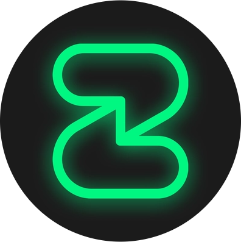

<p align="center">
  
</p>

<h1 align="center">Session AI Agent — Android</h1>

<p align="center">Set up your own private AI agent on Session Messenger — straight from your phone, no terminal.</p>

<p align="center">
  <a href="https://github.com/websplaining/session-ai-agent-android/releases/latest">
    
  </a>
</p>
<p align="center">
  <a href="https://github.com/websplaining/session-ai-agent-android/releases/latest"></a>
  
  
  
</p>

<p align="center"><sub>Android 8+ · allow install from unknown sources · see <a href="docs/TESTING.md">docs/TESTING.md</a> for the test walkthrough</sub></p>

---

> **Status:** in development. The website installer at [sessionaiagent.com](https://sessionaiagent.com) is unchanged and remains the primary path; this app is a separate, self-contained client that performs the same setup on your server.

## How it works

```
Android app ──SSH (password, host-key pinning)──▶ your VPS
   1. uploads scripts/saa-app-setup.sh
   2. runs it non-interactively with your inputs
   3. streams progress back to the wizard
   4. shows the bot Session ID to paste into Session
```

- Talks **directly to your server** — nothing is routed through any third party
- Uses the same bridge artifact (`session-claw-bridge-v2.tar.gz`) as the website installer
- Supports both engines: **OpenClaw** (default) and **Hermes Agent**

## What the wizard asks for

1. VPS host / IP, SSH port (default 22), user (default root), password
2. Your 13-word Session recovery password (for the bot account)
3. Your Session ID (only this ID can message the bot)
4. OpenCode Go API key ([referral link](https://opencode.ai/go?ref=9Q6GKAZPK6) — $10/month, $5 usage credit via the link)
5. Engine: OpenClaw or Hermes
6. Model: chosen from the models your plan actually supports (live availability probe, cached for 24h with a Refresh button)
7. Install with a live **0-100% progress bar** and detailed log

After setup you can, from the app: **change model**, **switch engine**, **view the bot Session ID**, or **uninstall** — all without a terminal.

## Links

| | | |
|---|---|---|
|  | [**Kamatera VPS**](https://kamatera.sjv.io/c/1245219/3024352/36439) | recommended VPS — $4/month, free 30-day trial ($100 credits) |
|  | [**OpenCode Go**](https://opencode.ai/go?ref=9Q6GKAZPK6) | required AI subscription — $10/month, $5 usage credit via the link |
|  | [**Websplaining on YouTube**](https://www.youtube.com/@Websplaining) | setup guides & demos |
|  | [**Session AI Agent**](https://sessionaiagent.com) | main project — website installer, docs, live node dashboard |

## Security

- SSH password is **never stored** and never leaves your device except to your own server
- Host key is pinned on first connection (TOFU) and verified afterwards
- Secrets are never written to logs
- The app has no analytics, no ads, no tracking, and no self-update mechanism

## Build

```bash
./gradlew assembleDebug     # build a debug APK
./gradlew assembleRelease   # signed release build (requires keystore, see CONTRIBUTING docs)
```

Requirements: JDK 17+, Android SDK (compileSdk 35).

## F-Droid

 The project is designed to meet F-Droid inclusion requirements: Apache-2.0, no Google Play Services / Firebase / trackers, no self-updating, public source, fastlane metadata included. (Not submitted yet.)

## License

Apache-2.0 — see [LICENSE](LICENSE).
